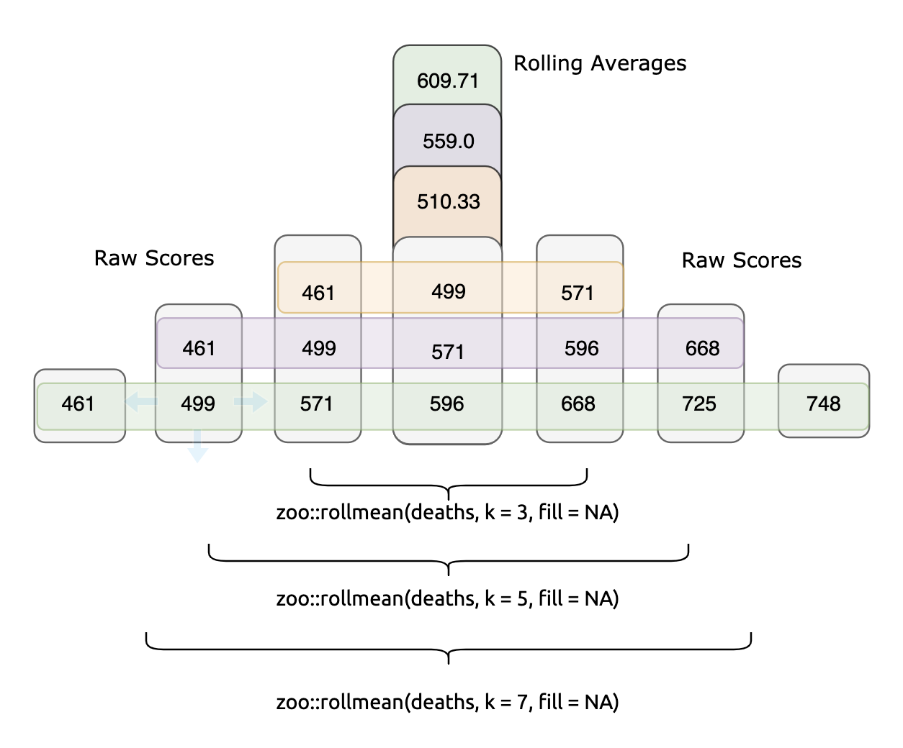
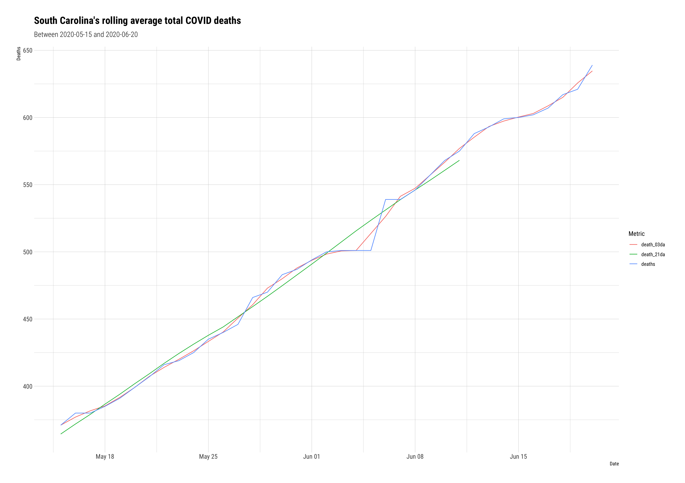
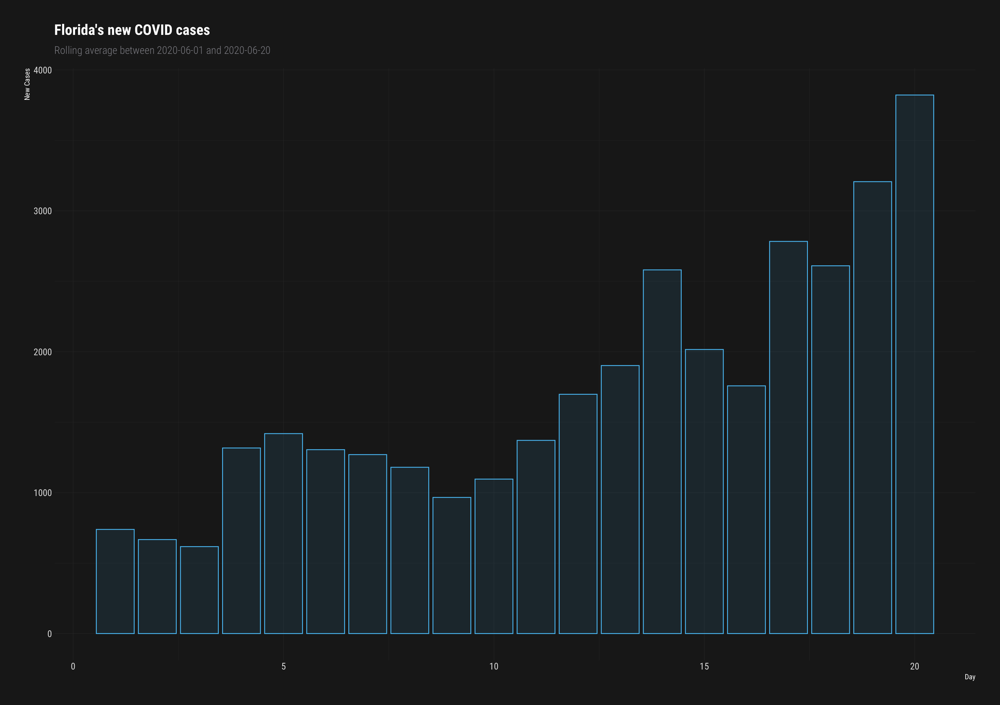

```{r setup, include=FALSE, warning=FALSE, message=FALSE}
library(knitr)
library(rmdformats)
library(tidyverse)
library(devtools)
# figs folder
fs::dir_create("figs")
# data folder
fs::dir_create("data")
# docs folder
fs::dir_create("docs")
# chunk options
knitr::opts_chunk$set(
  echo = TRUE, # show/hide all code
  tidy = FALSE, # cleaner code printing
  comment = "#> ", # better console printing
  eval = TRUE, # turn this to FALSE stop code chunks from running
  message = TRUE, # show messages
  warning = FALSE, # show warnings
  size = "small", # size of the text
  fig.width = 8.5,
  fig.height = 6,
  fig.path = "figs/" # location of files
) 
# knit options
knitr::opts_knit$set(
  width = 78,
  progress = FALSE
)
# base options
base::options(
  tibble.print_max = 25,
  tibble.width = 78,
  max.print = 999999,
  scipen = 100000000
)
```

## Rolling averages

Rolling (or moving) averages are a way to reduce noise and smooth time series data. This post will cover how to compute and visualize rolling averages for the new cases and deaths of COVID patients in United States. 

## Packages

We'll load the packages below for `ggplot2`, `geofacet` and `hrbrthemes` for dope graph themes.

```{r smoothing-averages-packages, message=FALSE, warning=FALSE}
library(ggpubr) # grid arrage
library(zoo) # moving averages        
library(tidyverse) # all tidyverse packages
library(plotly) # more plots
library(skimr) # summaries 
library(hrbrthemes) # themes for graphs
library(socviz) # %nin%
library(openintro) # 
library(geofacet) # 
library(usmap) # lat and long
library(socviz) # for %nin%
library(ggmap) # mapping
```

## The Johns Hopkins COVID data 

The code block below imports the COVID-19 data from [Center for Systems Science and Engineering at the Johns Hopkins Whiting School of Engineering](https://github.com/CSSEGISandData/COVID-19) using the [`fs`](https://www.tidyverse.org/blog/2018/01/fs-1.0.0/) and [`purrr`](https://purrr.tidyverse.org/) packages. 

```{r import}
JHCovid19States <- readr::read_csv("https://raw.githubusercontent.com/mjfrigaard/storybench/master/drafts/data/jhsph/2020-06-22-JHCovid19States.csv")
```


### Wrangling steps 

All the steps for wrangling these data are in [this gist.](https://gist.github.com/mjfrigaard/f19a550dfa1e08eaf2b70f7c9a2e3d13) We ended up with a data frame that has the following new columns. 

`state` - us state  
`state_abbr` - abbreviated state name   
`month_abbr` - month for data reported (with abbreviation)  
`date` - `as_date()` version of `last_update`

### State-level Johns Hopkins COVID data 

```{r head-JHCovid19States}
utils::head(JHCovid19States)
```

## Calculating rolling averages

Two states have [seen a rapid increase in their death rates](https://www.nytimes.com/2020/06/20/world/coronavirus-updates.html). We're going to calculate and visualize the rolling averages for cumulative deaths and new deaths in these states and compare them to the other 48 states. 
To calculate a simple moving average (over 7 days), we can use the `rollmean()` function from the [zoo package.](https://cran.r-project.org/web/packages/zoo/index.html). This function takes a `k`, which is an '*integer width of the rolling window.* The code below calculates a 3, 5, 7, 15, and 21-day rolling average for the `deaths` from COVID in the US. 

```{r rollmean-deaths}
JHCovid19States <- JHCovid19States %>%
    dplyr::arrange(desc(state)) %>% 
    dplyr::group_by(state) %>% 
    dplyr::mutate(death_03da = zoo::rollmean(deaths, k = 3, fill = NA),
                  death_05da = zoo::rollmean(deaths, k = 5, fill = NA),
                  death_07da = zoo::rollmean(deaths, k = 7, fill = NA),
                  death_15da = zoo::rollmean(deaths, k = 15, fill = NA),
                  death_21da = zoo::rollmean(deaths, k = 21, fill = NA)) %>% 
  dplyr::ungroup()
```

Below is an example of this calculation for the state of Florida, 

```{r Florida-death-rolling-mean}
JHCovid19States %>% 
  dplyr::arrange(date) %>% 
  dplyr::filter(state == "Florida") %>% 
  dplyr::select(state,
                date,
                deaths,
                death_03da:death_07da) %>% 
  utils::head(7)
```

The calculation works like so, 

- the first value in our new `death_03da` variable (`510.3333	`) is the average `deaths` in Florida from the first date with a data point on either side of it (i.e. the date `2020-04-13` has `2020-04-12` preceding it, and `2020-04-14` following it). We can check our math below.

```{r check-death_3da}
mean(c(461, 499, 571))
```

- the first value in `death_05da` (`132.0`) is the average `deaths` in Florida from the first date with **two** data points on either side of it (`2020-04-14` has `2020-04-12` and `2020-04-13` preceding it, and `2020-04-15` and `2020-04-16` following it). We can check our math below.

```{r check-death_5da}
mean(c(461, 499, 571, 596, 668))
```

- And the first value in `death_07da` (`609.7143`) is the average `deaths` in Arizona from the first date with three data points on either side of it (`2020-04-15` has `2020-04-12`, `2020-04-13` and `2020-04-14` preceding it, and `2020-04-16`, `2020-04-17`, and `2020-04-18` following it). Check our math again:

```{r check-death_07da}
mean(c(461, 499, 571, 596, 668, 725, 748))
```

It's good practice to calculate rolling averages using an odd number for `k` (it makes the resulting values symmetrical).

```{r 38-rolling-averages.png, echo=FALSE}

```

Each rolling mean is calculated from the numbers surrounding it. If we want to visualize and compare the three rolling means against the original raw data, we can do this with a little wrangling.

```{r gg_fl_death_avgs}
gg_fl_death_avgs <- JHCovid19States %>% 
  dplyr::filter(state == "Florida") %>% 
  tidyr::pivot_longer(names_to = "rolling_mean_key", 
                    values_to = "rolling_mean_value", 
                    cols = c(deaths, 
                             death_03da, 
                             death_21da)) %>%
  dplyr::filter(date >= lubridate::as_date("2020-05-15") & # after may 15
                  date <= lubridate::as_date("2020-06-20")) %>% # before june 20
  ggplot2::ggplot(aes(x = date, 
                      y = rolling_mean_value, 
                      color = rolling_mean_key)) +
  ggplot2::geom_line() +   
  ggplot2::labs(title = "Florida's rolling average total COVID deaths", 
                  subtitle = "Between 2020-05-15 and 2020-06-20",
                  y = "Deaths", 
                  color = "Metric",
                  x = "Date") + 
  hrbrthemes::theme_ipsum_rc()
```

```{r gg_sc_death_avgs}
gg_sc_death_avgs <- JHCovid19States %>% 
  dplyr::filter(state == "South Carolina") %>% 
  tidyr::pivot_longer(names_to = "rolling_mean_key", 
                    values_to = "rolling_mean_value", 
                    cols = c(deaths, 
                             death_03da, 
                             death_21da)) %>%
  dplyr::filter(date >= lubridate::as_date("2020-05-15") & # after may 15
                  date <= lubridate::as_date("2020-06-20")) %>% # before june 20
  ggplot2::ggplot(aes(x = date, 
                      y = rolling_mean_value, 
                      color = rolling_mean_key)) +
  ggplot2::geom_line() +   
  ggplot2::labs(title = "South Carolina's rolling average total COVID deaths", 
                  subtitle = "Between 2020-05-15 and 2020-06-20",
                  y = "Deaths", 
                  color = "Metric",
                  x = "Date") + 
  hrbrthemes::theme_ipsum_rc()
```

```{r 38-gg-fl-death-avgs.png, echo=FALSE}
knitr::include_graphics("figs/38-gg-fl-death-avgs.png")
```

```{r 38-gg-sc-death-avgs, echo=FALSE}

```

## How does `rollmean()` work?

The `zoo::rollmean()` function works by successively averaging each period (`k`) together. Knowing which period (`k`) to use in `zoo::rollmean()` is a judgment call. The higher the value of `k`, the smoother the line gets, but are also sacrificing more data. If we compare the 3-day average (`death_3da`) to the 21-day average (`death_21da`), we see the line for `deaths` gets increasingly smooth. 

## Calculating new cases in each state

Below we get some help from [`dplyr::lag()`](https://dplyr.tidyverse.org/reference/lead-lag.html) to calculate the new cases in each state per day. We join this new calculation back to the `JHCovid19States` dataset, but rename it `JHCovid19NewCases`.

```{r JHCovid19NewCases}
JHCovid19NewCases <- JHCovid19States %>%
  # group this by state and day
  group_by(state, date) %>% 
  # get total deaths per day
  dplyr::summarize(
    confirmed_sum = (sum(confirmed, na.rm = TRUE))) %>% 
  # calculate 'new deaths' = todays deaths - yesterdays deaths
  mutate(new_confirmed_cases = confirmed_sum - dplyr::lag(x = confirmed_sum, n = 1, 
                                              order_by = date)) %>% 
  dplyr::select(state, 
                new_confirmed_cases, 
                date) %>% 
  # join back to JHCovid19
  dplyr::left_join(., y = JHCovid19States, 
                   by = c("state", "date")) %>% 
  # reorganize
  dplyr::select(state,
                state_abbr,
                date,
                month_abbr,
                day,
                confirmed,
                dplyr::contains("confirm"),
                dplyr::contains("death"),
                lat, 
                long, 
                dplyr::ends_with("rate"))
# check SC
JHCovid19NewCases %>% 
  dplyr::filter(state == "South Carolina") %>% 
  dplyr::select(state_abbr, date, confirmed, new_confirmed_cases) %>% 
  utils::head()
```

We can check this math below, too.

```{r check-new_deaths}
3391 - 3320 # 2020-04-13
3553 - 3391 # 2020-04-14
3656 - 3553  # 2020-04-15
3931 - 3656 # 2020-04-16
4099 - 3931  # 2020-04-17
```

We can see this calculation is getting the number of new confirmed cases each day correct. Now we can calculate the rolling mean for the new confirmed cases in each state. 

```{r rollmean-new_confirmed_cases}
JHCovid19NewCases <- JHCovid19NewCases %>%
    dplyr::group_by(state) %>% 
    dplyr::mutate(
      new_conf_03da = zoo::rollmean(new_confirmed_cases, k = 3, fill = NA),
      new_conf_05da = zoo::rollmean(new_confirmed_cases, k = 5, fill = NA),
      new_conf_07da = zoo::rollmean(new_confirmed_cases, k = 7, fill = NA),
      new_conf_15da = zoo::rollmean(new_confirmed_cases, k = 15, fill = NA),
      new_conf_21da = zoo::rollmean(new_confirmed_cases, k = 21, fill = NA)) %>% 
  dplyr::ungroup()
```


## Moving averages with geofacets 

We'll take a look at the seven-day moving averages of new cases across all states using the [`geofacet`](https://hafen.github.io/geofacet/) package. First we'll build two plots for Florida, combine them, and then extend this to the entire country. 

First we will limit these data to June st1-June 21st.

```{r JHCovid19NewCasesJun}
JHCovid19NewCasesJun <- JHCovid19NewCases %>% 
      dplyr::filter(date >= lubridate::as_date("2020-06-01") & # after june 1
                  date <= lubridate::as_date("2020-06-20")) # before june 20
```


### Column graph for new cases

This creates a [`ggplot2::geom_col()`](https://ggplot2.tidyverse.org/reference/geom_bar.html) for `new_confirmed_cases`. We will build these two graphs with [`hrbrthemes::theme_modern_rc()`](https://github.com/hrbrmstr/hrbrthemes).

```{r gg_fl_new_cases_col, eval=FALSE}
JHCovid19NewCasesJun %>% 
  dplyr::filter(state == "Florida") %>% 
    ggplot2::ggplot(aes(x = day, 
                      y = new_confirmed_cases)) +
    geom_col(alpha = 1/10) + 
    ggplot2::labs(title = "Florida's new COVID cases", 
                  subtitle = "Rolling average between 2020-06-01 and 2020-06-20",
                  y = "New Cases", 
                  x = "Day") + 
  hrbrthemes::theme_modern_rc()
```

```{r 38-gg_fl_new_cases_col, echo=FALSE}
# fs::dir_ls("figs")

```

Now we want to add lines for the `new_conf_` variables, so this takes a little wrangling. 

```{r FLNewCasesTidy}
FLNewCasesTidy <- JHCovid19NewCasesJun %>% 
  # only Florida
  dplyr::filter(state == "Florida") %>% 
  # pivot longer
  tidyr::pivot_longer(names_to = "new_conf_av_key", 
                    values_to = "new_conf_av_value", 
                    cols = c(new_conf_03da,
                             new_conf_05da,
                             new_conf_07da)) %>% 
  # reduce vars
  dplyr::select(day, 
                date, 
                state, 
                state_abbr, 
                new_conf_av_value, 
                new_conf_av_key)
head(FLNewCasesTidy)
```
Now we can combine them into a single plot.

```{r gg_fl_new_cases_col-line, eval=FALSE}
JHCovid19NewCasesJun %>% 
  # florida new cases 
  dplyr::filter(state == "Florida") %>% 
    ggplot2::ggplot(aes(x = day, 
                      y = new_confirmed_cases, 
                      group(date))) +
    geom_col(alpha = 1/10) + 
  # add the line with new data
    ggplot2::geom_line(data = FLNewCasesTidy, 
                       mapping = aes(x = day, 
                                     y = new_conf_av_value, 
                                     color = new_conf_av_key)) +   
    ggplot2::labs(title = "Florida's new COVID cases", 
                  subtitle = "Rolling average between 2020-06-01 and 2020-06-20",
                  y = "New Cases", 
                  color = "Metric",
                  x = "Day") + 
    hrbrthemes::theme_modern_rc()
```

```{r 38-gg_fl_new_cases_col-line, echo=FALSE}
# fs::dir_ls("figs")
knitr::include_graphics("figs/38-gg_fl_new_cases_col-line.png")
```

We can see that the blue (7-day average) of new confirmed cases is definitely the smoothest line. Let's compare it to the 7-day average using a `geofacet`. First we will build our tidy data frame of new confirmed case metrics. 

```{r NewCasesTidy}
NewCasesTidy <- JHCovid19NewCasesJun %>% 
  # pivot longer
  tidyr::pivot_longer(names_to = "new_conf_av_key", 
                    values_to = "new_conf_av_value", 
                    cols = c(new_conf_03da,
                             new_conf_07da)) %>% 
    # better labels for printing
  dplyr::mutate(new_conf_av_key = dplyr::case_when(
    new_conf_av_key == "new_conf_03da" ~ "3-day new confirmed cases",
    new_conf_av_key == "new_conf_07da" ~ "7-day new confirmed cases",
    TRUE ~ NA_character_)) %>% 
  # reduce vars
  dplyr::select(day, 
                date, 
                state, 
                state_abbr, 
                new_conf_av_value, 
                new_conf_av_key)
head(NewCasesTidy)
```

And We'll switch the theme to [`hrbrthemes::theme_ipsum_tw()`](https://hrbrmstr.github.io/hrbrthemes/).

```{r gg_col_line_facet_geo_new_conf, eval=FALSE}
# get min and max for labels
min_date <- min(JHCovid19NewCasesJun$date, na.rm = TRUE)
max_date <- max(JHCovid19NewCasesJun$date, na.rm = TRUE)
JHCovid19NewCasesJun %>% 
    ggplot2::ggplot(aes(x = day, 
                      y = new_confirmed_cases)) +
    geom_col(alpha = 3/10, linetype = 0) + 
    ggplot2::geom_line(data = NewCasesTidy, 
                       mapping = aes(x = day, 
                                     y = new_conf_av_value, 
                                     color = new_conf_av_key)) +  
    geofacet::facet_geo( ~ state_abbr, 
                       grid = "us_state_grid2",
                       scales = "free_y")  +
    ggplot2::labs(title = "US rolling 3 and 7-day averages of new COVID cases", 
                  subtitle = "Between 2020-05-31 and 2020-06-20",
                  y = "New Cases",
                  color = "Metric:", 
                  x = "Day") + 
  hrbrthemes::theme_ipsum_tw() + 
  theme(axis.title.x = element_blank(),
        axis.text.x = element_blank(),
        axis.ticks.x = element_blank()) + 
      ggplot2::theme(legend.position = "top")
```

```{r 38-gg_facet_col_line_geo_new_conf, echo=FALSE}
# fs::dir_ls("figs")
knitr::include_graphics("figs/38-gg_facet_col_line_geo_new_conf.png")
```

I can also compare this with the 7-day rolling average deaths per state. 


```{r gg_facet_geo_deaths}
gg_facet_geo_deaths <- JHCovid19NewCasesJun %>% 
  dplyr::select(`7-day average deaths` = death_07da,
                dplyr::everything()) %>% 
  ggplot2::ggplot(aes(x = day, 
                      y = `7-day average deaths`)) +
  ggplot2::geom_line(show.legend = FALSE) +   
  geofacet::facet_geo( ~ state_abbr, 
                       grid = "us_state_grid1", 
                       scales = "free")  +
    ggplot2::labs(title = "US 7-day averages of COVID deaths", 
                  subtitle = "Between 2020-06-01 and 2020-06-21",
                  y = "Deaths",
                  x = "Day") + 
    hrbrthemes::theme_ipsum_ps() + 
    theme(axis.title.x = element_blank(),
        axis.text.x = element_blank(),
        axis.ticks.x = element_blank()) + 
      ggplot2::theme(legend.position = "top")
```

```{r 38-gg_facet_geo_deaths, echo=FALSE}
knitr::include_graphics("figs/38-gg_facet_geo_deaths.png")
```

### More notes on rolling/moving averages:

- "*A moving average term in a time series model is a past error (multiplied by a coefficient). Moving average is also used to smooth the series. It does this be removing noise from the time series by successively averaging terms together*" - Machine Learning Using R: With Time Series and Industry-Based Use Cases in R 

- ["*Moving averages is a smoothing approach that averages values from a window of consecutive time periods, thereby generating a series of averages. The moving average approaches primarily differ based on the number of values averaged, how the average is computed, and how many times averaging is performed*"](https://uc-r.github.io/ts_moving_averages).

- [*"To compute the moving average of size k at a point p, the k values symmetric about p are averaged together which then replace the current value. The more points are considered for computing the moving average, the smoother the curve becomes.*"](http://www.feat.engineering/reducing-other-noise.html)


