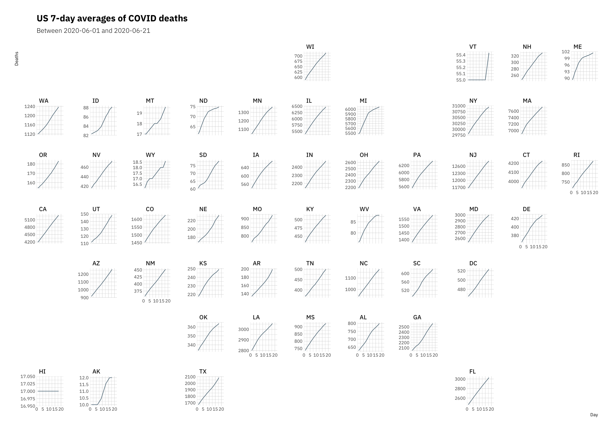

How to calculate a rolling average
================
Martin Frigaard

## Rolling averages

Rolling (or moving) averages are a way to reduce noise and smooth time
series data. This post will cover how to compute and visualize rolling
averages for the new cases and deaths of COVID patients in United
States.

## Packages

We’ll load the packages below and set our graph theme.

``` r
library(ggpubr) # grid arrage
library(zoo) # moving averages        
library(tidyverse) # all tidyverse packages
library(plotly) # more plots
library(skimr) # summaries 
library(hrbrthemes) # themes for graphs
library(socviz) # %nin%
library(openintro) # 
library(geofacet) # 
library(usmap) # lat and long
library(socviz) # for %nin%
library(ggmap) # mapping
library(forecast)
```

## The Johns Hopkins COVID data

The code block below imports the COVID-19 data from [Center for Systems
Science and Engineering at the Johns Hopkins Whiting School of
Engineering](https://github.com/CSSEGISandData/COVID-19) using the
[`fs`](https://www.tidyverse.org/blog/2018/01/fs-1.0.0/) and
[`purrr`](https://purrr.tidyverse.org/) packages.

``` r
csse_csv_files <- fs::dir_ls(path = "data/jhsph/COVID-19/csse_covid_19_data/csse_covid_19_daily_reports_us", 
                             glob = "*.csv")
JHCovid19DataRaw <- csse_csv_files %>%
  purrr::map_df(.f = read_csv, .id = "file", col_types = cols()) %>% 
    janitor::clean_names(case = "snake")
# head(JHSPH2019CovidData)
# only need cases by state
JHCovid19DataRaw %>% dplyr::glimpse()
```

    #>  Rows: 4,078
    #>  Columns: 19
    #>  $ file                 <chr> "data/jhsph/COVID-19/csse_covid_19_data/csse_c…
    #>  $ province_state       <chr> "Alabama", "Alaska", "Arizona", "Arkansas", "C…
    #>  $ country_region       <chr> "US", "US", "US", "US", "US", "US", "US", "US"…
    #>  $ last_update          <dttm> 2020-04-12 23:18:15, 2020-04-12 23:18:15, 202…
    #>  $ lat                  <dbl> 32.3182, 61.3707, 33.7298, 34.9697, 36.1162, 3…
    #>  $ long                 <dbl> -86.9023, -152.4044, -111.4312, -92.3731, -119…
    #>  $ confirmed            <dbl> 3563, 272, 3542, 1280, 22795, 7307, 12035, 162…
    #>  $ deaths               <dbl> 93, 8, 115, 27, 640, 289, 554, 35, 0, 50, 461,…
    #>  $ recovered            <dbl> NA, 66, NA, 367, NA, NA, NA, 191, 0, 493, NA, …
    #>  $ active               <dbl> 3470, 264, 3427, 1253, 22155, 7018, 11481, 159…
    #>  $ fips                 <dbl> 1, 2, 4, 5, 6, 8, 9, 10, 888, 11, 12, 13, 999,…
    #>  $ incident_rate        <dbl> 75.98802, 45.50405, 48.66242, 49.43942, 58.137…
    #>  $ people_tested        <dbl> 21583, 8038, 42109, 19722, 190328, 34873, 4122…
    #>  $ people_hospitalized  <dbl> 437, 31, NA, 130, 5234, 1376, 1654, 190, NA, N…
    #>  $ mortality_rate       <dbl> 2.610160, 2.941176, 3.246753, 2.109375, 2.8120…
    #>  $ uid                  <dbl> 84000001, 84000002, 84000004, 84000005, 840000…
    #>  $ iso3                 <chr> "USA", "USA", "USA", "USA", "USA", "USA", "USA…
    #>  $ testing_rate         <dbl> 460.3002, 1344.7116, 578.5223, 761.7534, 485.4…
    #>  $ hospitalization_rate <dbl> 12.264945, 11.397059, NA, 10.156250, 22.961176…

I’ll also convert the `last_update` column to a `date` variable with
some help from [`lubridate`](https://lubridate.tidyverse.org/).

``` r
JHCovid19 <- JHCovid19DataRaw %>% 
  dplyr::mutate(date = lubridate::as_date(last_update))
```

Next we’ll get the state abbreviations by creating a crosswalk table and
joining these with the `JHCovid19NewDeaths` dataset.

``` r
StateCrosswalk <- tibble::tibble(state = state.name) %>%
  # stick this to the abbreviations
   dplyr::bind_cols(tibble::tibble(state_abbr = state.abb)) %>% 
  # bind this to District of Columbia
   dplyr::bind_rows(tibble(state = "District of Columbia", 
                           state_abbr = "DC")) %>% 
  dplyr::rename(province_state = state)
head(StateCrosswalk)
```

    #>  # A tibble: 6 x 2
    #>    province_state state_abbr
    #>    <chr>          <chr>     
    #>  1 Alabama        AL        
    #>  2 Alaska         AK        
    #>  3 Arizona        AZ        
    #>  4 Arkansas       AR        
    #>  5 California     CA        
    #>  6 Colorado       CO

Now we join the `state_abbr` column to `JHCovid19` and remove the
non-states in the `JHCovid19States` dataset.

``` r
JHCovid19States <- JHCovid19 %>% 
                # join these two together
                dplyr::inner_join(x = ., 
                                 y = StateCrosswalk,
                                 by = "province_state")
# remove non-states
JHCovid19States <- JHCovid19States %>% 
    dplyr::filter(province_state %nin% c("American Samoa", "Diamond Princess", 
                                         "Grand Princess", "Guam", 
                                         "Northern Mariana Islands", 
                                         "Puerto Rico", "Virgin Islands"))
```

Now we’ll create new `month_abbr` and `day` variables, remove missing
values, calculate the moving seven-day average per state, then limit
these data to the month of May.

``` r
JHCovid19States <- JHCovid19States %>% 
  # months
  dplyr::mutate(month_abbr = lubridate::month(date, label = TRUE, 
                                                 abbr = TRUE),
                # day
                day = lubridate::day(date)) %>% 
  dplyr::rename(state = province_state) %>% 
  dplyr::select(-c(file, country_region, uid, iso3))
```

### State-level Johns Hopkins COVID data

``` r
utils::head(JHCovid19States)
```

    #>  # A tibble: 6 x 19
    #>    state last_update           lat   long confirmed deaths recovered active
    #>    <chr> <dttm>              <dbl>  <dbl>     <dbl>  <dbl>     <dbl>  <dbl>
    #>  1 Alab… 2020-04-12 23:18:15  32.3  -86.9      3563     93        NA   3470
    #>  2 Alas… 2020-04-12 23:18:15  61.4 -152.        272      8        66    264
    #>  3 Ariz… 2020-04-12 23:18:15  33.7 -111.       3542    115        NA   3427
    #>  4 Arka… 2020-04-12 23:18:15  35.0  -92.4      1280     27       367   1253
    #>  5 Cali… 2020-04-12 23:18:15  36.1 -120.      22795    640        NA  22155
    #>  6 Colo… 2020-04-12 23:18:15  39.1 -105.       7307    289        NA   7018
    #>  # … with 11 more variables: fips <dbl>, incident_rate <dbl>,
    #>  #   people_tested <dbl>, people_hospitalized <dbl>, mortality_rate <dbl>,
    #>  #   testing_rate <dbl>, hospitalization_rate <dbl>, date <date>,
    #>  #   state_abbr <chr>, month_abbr <ord>, day <int>

## Calculate rolling averages

Two states have [seen a rapid increase in their death
rates](https://www.nytimes.com/2020/06/20/world/coronavirus-updates.html).
We’re going to calculate and visualize the rolling averages for
cumulative deaths and new deaths in these states and compare them to the
other 48 states.

To calculate a simple moving average (over 7 days), we can use the
`rollmean()` function from the [zoo
package.](https://cran.r-project.org/web/packages/zoo/index.html). This
function takes a `k`, which is an ’*integer width of the rolling
window.* The code below calculates a 3, 5, 7, 15, and 21-day rolling
average for the `deaths` from COVID in the US.

``` r
JHCovid19States <- JHCovid19States %>%
    dplyr::arrange(desc(state)) %>% 
    dplyr::group_by(state) %>% 
    dplyr::mutate(death_03da = zoo::rollmean(deaths, k = 3, fill = NA),
                  death_05da = zoo::rollmean(deaths, k = 5, fill = NA),
                  death_07da = zoo::rollmean(deaths, k = 7, fill = NA),
                  death_15da = zoo::rollmean(deaths, k = 15, fill = NA),
                  death_21da = zoo::rollmean(deaths, k = 21, fill = NA)) %>% 
  dplyr::ungroup()
```

Below is an example of this calculation for the state of Florida,

``` r
JHCovid19States %>% 
  dplyr::arrange(date) %>% 
  dplyr::filter(state == "Florida") %>% 
  dplyr::select(state,
                date,
                deaths,
                death_03da:death_07da) %>% 
  utils::head(7)
```

    #>  # A tibble: 7 x 6
    #>    state   date       deaths death_03da death_05da death_07da
    #>    <chr>   <date>      <dbl>      <dbl>      <dbl>      <dbl>
    #>  1 Florida 2020-04-12    461        NA         NA         NA 
    #>  2 Florida 2020-04-14    499       510.        NA         NA 
    #>  3 Florida 2020-04-14    571       555.       559         NA 
    #>  4 Florida 2020-04-15    596       612.       612.       610.
    #>  5 Florida 2020-04-16    668       663        662.       654.
    #>  6 Florida 2020-04-17    725       714.       702.       701.
    #>  7 Florida 2020-04-18    748       749        747.       743.

The calculation works like so,

  - the first value in our new `death_03da` variable (`510.3333`) is the
    average `deaths` in Florida from the first date with a data point on
    either side of it (i.e. the date `2020-04-13` has `2020-04-12`
    preceding it, and `2020-04-14` following it). We can check our math
    below.

<!-- end list -->

``` r
mean(c(461, 499, 571))
```

    #>  [1] 510.3333

  - the first value in `death_05da` (`132.0`) is the average `deaths` in
    Florida from the first date with **two** data points on either side
    of it (`2020-04-14` has `2020-04-12` and `2020-04-13` preceding it,
    and `2020-04-15` and `2020-04-16` following it). We can check our
    math below.

<!-- end list -->

``` r
mean(c(461, 499, 571, 596, 668))
```

    #>  [1] 559

  - And the first value in `death_07da` (`609.7143`) is the average
    `deaths` in Arizona from the first date with three data points on
    either side of it (`2020-04-15` has `2020-04-12`, `2020-04-13` and
    `2020-04-14` preceding it, and `2020-04-16`, `2020-04-17`, and
    `2020-04-18` following it). Check our math again:

<!-- end list -->

``` r
mean(c(461, 499, 571, 596, 668, 725, 748))
```

    #>  [1] 609.7143

It’s good practice to calculate rolling averages using an odd number for
`k` (it makes the resulting values symmetrical).


Each rolling mean is calculated from the numbers surrounding it. If we
want to visualize and compare the three rolling means against the
original raw data, we can do this with a little wrangling.

``` r
gg_fl_death_avgs <- JHCovid19States %>% 
  dplyr::filter(state == "Florida") %>% 
  tidyr::pivot_longer(names_to = "rolling_mean_key", 
                    values_to = "rolling_mean_value", 
                    cols = c(deaths, 
                             death_03da, 
                             death_21da)) %>%
  dplyr::filter(date >= lubridate::as_date("2020-05-15") & # after may 15
                  date <= lubridate::as_date("2020-06-20")) %>% # before june 20
  ggplot2::ggplot(aes(x = date, 
                      y = rolling_mean_value, 
                      color = rolling_mean_key)) +
  ggplot2::geom_line() +   
  ggplot2::labs(title = "Florida's rolling average total COVID deaths", 
                  subtitle = "Between 2020-05-15 and 2020-06-20",
                  y = "Deaths", 
                  color = "Metric",
                  x = "Date") + 
  hrbrthemes::theme_ipsum_rc()
gg_sc_death_avgs <- JHCovid19States %>% 
  dplyr::filter(state == "South Carolina") %>% 
  tidyr::pivot_longer(names_to = "rolling_mean_key", 
                    values_to = "rolling_mean_value", 
                    cols = c(deaths, 
                             death_03da, 
                             death_21da)) %>%
  dplyr::filter(date >= lubridate::as_date("2020-05-15") & # after may 15
                  date <= lubridate::as_date("2020-06-20")) %>% # before june 20
  ggplot2::ggplot(aes(x = date, 
                      y = rolling_mean_value, 
                      color = rolling_mean_key)) +
  ggplot2::geom_line() +   
  ggplot2::labs(title = "South Carolina's rolling average total COVID deaths", 
                  subtitle = "Between 2020-05-15 and 2020-06-20",
                  y = "Deaths", 
                  color = "Metric",
                  x = "Date") + 
  hrbrthemes::theme_ipsum_rc()
```


The `zoo::rollmean()` function works by successively averaging each
period (`k`) together. Knowing which period (`k`) to use in
`zoo::rollmean()` is a judgment call. The higher the value of `k`, the
smoother the line gets, but are also sacrificing more data. If we
compare the 3-day average (`death_3da`) to the 21-day average
(`death_21da`), we see the line for `deaths` gets increasingly smooth.

## Calculating new cases in each state

Below we get some help from
[`dplyr::lag()`](https://dplyr.tidyverse.org/reference/lead-lag.html) to
calculate the new cases in each state per day.

``` r
JHCovid19NewCases <- JHCovid19States %>%
  # group this by state and day
  group_by(state, date) %>% 
  # get total deaths per day
  dplyr::summarize(
    confirmed_sum = (sum(confirmed, na.rm = TRUE))) %>% 
  # calculate 'new deaths' = todays deaths - yesterdays deaths
  mutate(new_confirmed_cases = confirmed_sum - dplyr::lag(x = confirmed_sum, n = 1, 
                                              order_by = date)) %>% 
  dplyr::select(state, 
                new_confirmed_cases, 
                date) %>% 
  # join back to JHCovid19
  dplyr::left_join(., y = JHCovid19States, 
                   by = c("state", "date")) %>% 
  # reorganize
  dplyr::select(state,
                state_abbr,
                date,
                month_abbr,
                day,
                confirmed,
                dplyr::contains("confirm"),
                dplyr::contains("death"),
                lat, 
                long, 
                dplyr::ends_with("rate"))
```

    #>  `summarise()` regrouping output by 'state' (override with `.groups` argument)

``` r
# check SC
JHCovid19NewCases %>% 
  dplyr::filter(state == "South Carolina") %>% 
  dplyr::select(state_abbr, date, confirmed, new_confirmed_cases) %>% 
  utils::head()
```

    #>  Adding missing grouping variables: `state`

    #>  # A tibble: 6 x 5
    #>  # Groups:   state [1]
    #>    state          state_abbr date       confirmed new_confirmed_cases
    #>    <chr>          <chr>      <date>         <dbl>               <dbl>
    #>  1 South Carolina SC         2020-04-12      3320                  NA
    #>  2 South Carolina SC         2020-04-13      3391                  71
    #>  3 South Carolina SC         2020-04-14      3553                 162
    #>  4 South Carolina SC         2020-04-15      3656                 103
    #>  5 South Carolina SC         2020-04-16      3931                 275
    #>  6 South Carolina SC         2020-04-17      4099                 168

We can check this math below, too.

``` r
3391 - 3320 # 2020-04-13
```

    #>  [1] 71

``` r
3553 - 3391 # 2020-04-14
```

    #>  [1] 162

``` r
3656 - 3553  # 2020-04-15
```

    #>  [1] 103

``` r
3931 - 3656 # 2020-04-16
```

    #>  [1] 275

``` r
4099 - 3931  # 2020-04-17
```

    #>  [1] 168

Now we can calculate the rolling mean for the new confirmed cases in
each state.

``` r
JHCovid19NewCases <- JHCovid19NewCases %>%
    dplyr::group_by(state) %>% 
    dplyr::mutate(
      new_conf_03da = zoo::rollmean(new_confirmed_cases, k = 3, fill = NA),
      new_conf_05da = zoo::rollmean(new_confirmed_cases, k = 5, fill = NA),
      new_conf_07da = zoo::rollmean(new_confirmed_cases, k = 7, fill = NA),
      new_conf_15da = zoo::rollmean(new_confirmed_cases, k = 15, fill = NA),
      new_conf_21da = zoo::rollmean(new_confirmed_cases, k = 21, fill = NA)) %>% 
  dplyr::ungroup()
```

## Moving averages with geofacets

We’ll take a look at the seven-day moving averages of people
hospitalized across all states using the
[`geofacet`](https://hafen.github.io/geofacet/) package.

``` r
gg_fl_new_case_avgs <- JHCovid19NewCases %>% 
  dplyr::filter(state == "Florida") %>% 
  tidyr::pivot_longer(names_to = "new_conf_av_key", 
                    values_to = "new_conf_av_value", 
                    cols = c(new_conf_03da,
                             new_conf_05da,
                             new_conf_07da)) %>%
  dplyr::filter(date >= lubridate::as_date("2020-06-01") & # after june 1
                  date <= lubridate::as_date("2020-06-20")) %>% # before june 20
  ggplot2::ggplot(aes(x = day, 
                      y = new_conf_av_value, 
                      color = new_conf_av_key,
                      group(date))) +
  ggplot2::geom_line() +   
  ggplot2::labs(title = "Florida's new COVID cases", 
                  subtitle = "Rolling average between 2020-06-01 and 2020-06-20",
                  y = "New Deaths", 
                  color = "Metric",
                  x = "Day") + 
  hrbrthemes::theme_modern_rc()

gg_sc_new_case_avgs <- JHCovid19NewCases %>% 
  dplyr::filter(state == "South Carolina") %>% 
  tidyr::pivot_longer(names_to = "new_conf_av_key", 
                    values_to = "new_conf_av_value", 
                    cols = c(new_conf_03da,
                             new_conf_05da,
                             new_conf_07da)) %>%
  dplyr::filter(date >= lubridate::as_date("2020-06-01") & # after june 1
                  date <= lubridate::as_date("2020-06-20")) %>% # before june 20
  ggplot2::ggplot(aes(x = day, 
                      y = new_conf_av_value, 
                      color = new_conf_av_key,
                      group(date))) +
  ggplot2::geom_line() +   
  ggplot2::labs(title = "South Carolina's new COVID cases", 
                  subtitle = "Rolling average between 2020-06-01 and 2020-06-20",
                  y = "New Deaths", 
                  color = "Metric",
                  x = "Day") + 
  hrbrthemes::theme_modern_rc()
```


We can see that the blue (7-day average) of new confirmed cases is
definitely the smoothest line. Let’s compare it to the 7-day average
using a `geofacet` plot below. I like to combine this with
[`hrbrthemes::theme_ipsum_tw()`](https://hrbrmstr.github.io/hrbrthemes/).

``` r
gg_facet_geo_new_conf <- JHCovid19NewCases %>% 
  # on/after may 31
  dplyr::filter(date >= lubridate::as_date("2020-05-31") & 
                   # on/before june 21
                  date <= lubridate::as_date("2020-06-21")) %>%
    # reshape this for two rolling averages
    tidyr::pivot_longer(names_to = "new_conf_av_key", 
                    values_to = "new_conf_av_value", 
                    cols = c(new_conf_03da,
                             new_conf_07da)) %>% 
  # better labels for printing
  dplyr::mutate(new_conf_av_key = dplyr::case_when(
    new_conf_av_key == "new_conf_03da" ~ "3-day new confirmed cases",
    new_conf_av_key == "new_conf_07da" ~ "7-day new confirmed cases",
    TRUE ~ NA_character_)) %>% 
  ggplot2::ggplot(aes(x = day, 
                      y = new_conf_av_value, 
                      color = new_conf_av_key,
                      group(date))) +
  ggplot2::geom_line() +   
  geofacet::facet_geo( ~ state_abbr, 
                       grid = "us_state_grid1", 
                       scales = "free_y")  +
    ggplot2::labs(title = "US rolling 3 and 7-day averages of new COVID cases", 
                  subtitle = "Between 2020-05-31 and 2020-06-20",
                  y = "New Cases",
                  color = "Metric", 
                  x = "Day") + 
    hrbrthemes::theme_ipsum_tw() +
    scale_y_discrete(labels = c("3-day average", "7-day average")) +
    ggplot2::theme(legend.position = "top")
```


I can also compare this with the 3 and 7-day rolling average deaths per
state.

``` r
gg_facet_geo_deaths <- JHCovid19States %>% 
  # on/after june 1
  dplyr::filter(date >= lubridate::as_date("2020-06-01") & 
                  # on/before june 21
                date <= lubridate::as_date("2020-06-21")) %>% 
  dplyr::select(`7-day average deaths` = death_07da,
                dplyr::everything()) %>% 
  ggplot2::ggplot(aes(x = day, 
                      y = `7-day average deaths`)) +
  ggplot2::geom_line(show.legend = FALSE) +   
  geofacet::facet_geo( ~ state_abbr, 
                       grid = "us_state_grid1", 
                       scales = "free_y")  +
    ggplot2::labs(title = "US 7-day averages of COVID deaths", 
                  subtitle = "Between 2020-06-01 and 2020-06-21",
                  y = "Deaths",
                  x = "Day") + 
    hrbrthemes::theme_ipsum_ps()
```



### More notes on rolling/moving averages:

  - “*A moving average term in a time series model is a past error
    (multiplied by a coefficient). Moving average is also used to smooth
    the series. It does this be removing noise from the time series by
    successively averaging terms together*” - Machine Learning Using R:
    With Time Series and Industry-Based Use Cases in R

  - [“*Moving averages is a smoothing approach that averages values from
    a window of consecutive time periods, thereby generating a series of
    averages. The moving average approaches primarily differ based on
    the number of values averaged, how the average is computed, and how
    many times averaging is
    performed*”](https://uc-r.github.io/ts_moving_averages).

  - [*"To compute the moving average of size k at a point p, the k
    values symmetric about p are averaged together which then replace
    the current value. The more points are considered for computing the
    moving average, the smoother the curve
    becomes.*"](http://www.feat.engineering/reducing-other-noise.html)
