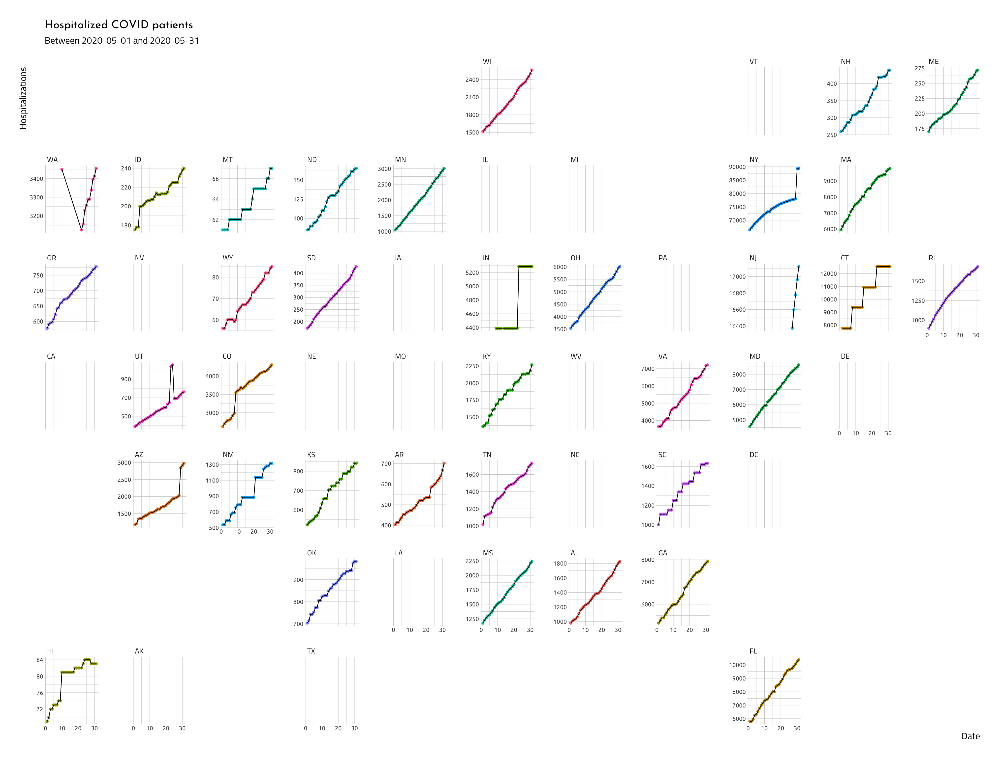
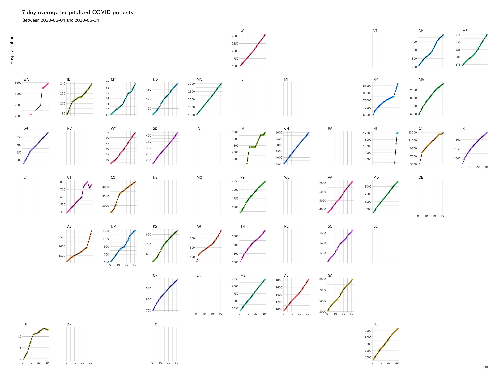

```{r setup, include=FALSE, warning=FALSE, message=FALSE}
library(knitr)
library(rmdformats)
library(tidyverse)
library(devtools)
# figs folder
fs::dir_create("figs")
# data folder
fs::dir_create("data")
# docs folder
fs::dir_create("docs")
# chunk options
knitr::opts_chunk$set(
  echo = TRUE, # show/hide all code
  tidy = FALSE, # cleaner code printing
  comment = "#> ", # better console printing
  eval = TRUE, # turn this to FALSE stop code chunks from running
  message = TRUE, # show messages
  warning = FALSE, # show warnings
  size = "small", # size of the text
  fig.path = "figs/", # location of files
  fig.height = 8, # height of figures
  fig.width = 10.5 # width of figures
) 
# knit options
knitr::opts_knit$set(
  width = 78,
  progress = FALSE
)
# base options
base::options(
  tibble.print_max = 25,
  tibble.width = 78,
  max.print = 999999,
  scipen = 100000000
)
```

## Moving averages

Moving averages are a way to reduce noise and smooth time series data. This post will cover how to compute and visualize a seven-day average for the hospitalized COVID patients in United States.

## Packages

We'll load the packages below and set our graph theme.

```{r smoothing-averages-packages, message=FALSE, warning=FALSE}
library(ggpubr) # grid arrage
library(fpp2)           
library(zoo) # moving averages        
library(quantmod)
library(tidyverse) # all tidyverse packages
library(plotly) # more plots
library(skimr) # summaries 
library(hrbrthemes) # themes for graphs
library(socviz)
library(openintro)
library(geofacet)
# graph theme
ggplot2::theme_set(hrbrthemes::theme_ipsum_tw(
  base_size = 9,
  strip_text_size = 11,
  axis_title_size = 14,
  plot_title_size = 17,
  subtitle_size = 14,
  base_family = "Ubuntu",
  strip_text_family = "TitilliumWeb-Regular",
  axis_title_family = "TitilliumWeb-Regular",
  subtitle_family = "TitilliumWeb-Regular",
  plot_title_family = "JosefinSans-Regular"
))
library(ggmap) # mapping
library(forecast)
```

## Import COVID data 

The code block below imports the COVID-19 data from [Center for Systems Science and Engineering at the Johns Hopkins Whiting School of Engineering](https://github.com/CSSEGISandData/COVID-19) using the [`fs`](https://www.tidyverse.org/blog/2018/01/fs-1.0.0/) and [`purrr`](https://purrr.tidyverse.org/) packages. We are going to limit these data to four states that have [relaxed their shelter in place restrictions](https://www.cnn.com/interactive/2020/us/states-reopen-coronavirus-trnd/): Arizona and South Carolina.

We'll also tidy up these data a bit with [`janitor::clean_names()`](https://sfirke.github.io/janitor/) and remove any non-USA data with missing latitude and longitude. 

```{r import, message=FALSE, warning=FALSE}
## ----import-csse_csv_files------------------------------------------
csse_csv_files <- fs::dir_ls(path = "data/jhsph/COVID-19/csse_covid_19_data/csse_covid_19_daily_reports_us", 
           glob = "*.csv")
# head(csse_csv_files)
DailyCovid19Raw <- csse_csv_files %>%
  purrr::map_df(.f = read_csv, .id = "file", col_types = cols()) %>% 
    janitor::clean_names(case = "snake")
DailyCovid19 <- DailyCovid19Raw %>% 
    # non-missing geospatial data
    dplyr::filter(!is.na(lat) & !is.na(long)) %>% 
    # state-level data
    dplyr::filter(province_state %in% 
                    c("Arizona", "South Carolina")) %>% 
    # reorganize
    dplyr::select(file, 
                  lat, 
                  long,
                  last_update,
                  province_state,
                  country_region,
                  iso3,
                  confirmed,
                  people_hospitalized,
                  deaths,
                  dplyr::ends_with("_rate")) 
```

We'll get a quick overview of the data with [`skimr`](https://docs.ropensci.org/skimr/).

```{r skimr}
# drop p25 and p75
my_skim <- skimr::skim_with(numeric = skimr::sfl(p25 = NULL, p75 = NULL))
DailyCovid19 %>% my_skim()
```

We want a tidy dataset with column for `people_hospitalized` cases, indexed by the `province_state`. I'll convert the `last_update` column to a `date` variable with some help from [`lubridate`.](https://lubridate.tidyverse.org/), and limit these data for one month (`2020-05-15` - `2020-06-14`) for the same of simplicity. 

```{r create-date}
MayJuneDCovid19 <- DailyCovid19 %>% 
  dplyr::mutate(date = lubridate::as_date(last_update)) %>% 
  dplyr::filter(date >= as.Date("2020-05-15") & 
                  date <= as.Date("2020-06-14")) 
my_skim(MayJuneDCovid19$date)
```


## Calculate rolling averages

To calculate a simple moving average (over 7 days), we can use the `rollmean()` function from the [zoo package.](https://cran.r-project.org/web/packages/zoo/index.html). This function takes a `k`, which is an '*integer width of the rolling window.* 

The code below calculates a 7, 15, and 21-day rolling average for the `people_hospitalized` from COVID in the US. It's good practice to calculate rolling averages in an odd order (it makes the resulting values symmetrical).

```{r assign-rolling-averages}
MayJuneDCovid19 <- MayJuneDCovid19 %>%
    dplyr::group_by(province_state) %>% 
    dplyr::mutate(hosp_7da = zoo::rollmean(people_hospitalized, k = 7, fill = NA),
                  hosp_15da = zoo::rollmean(people_hospitalized, k = 15, fill = NA),
                  hosp_21da = zoo::rollmean(people_hospitalized, k = 21, fill = NA)) %>% 
  dplyr::ungroup()
```


We will start by visualizing the `people_hospitalized` across the four states by piping it over to line graph from [`ggplot2`](https://ggplot2.tidyverse.org/reference/geom_path.html).

```{r visualize-southern-confirmed}
# date labels 
date_hosp_raw <- filter(MayJuneDCovid19, !is.na(people_hospitalized)) 
# plot
gg_hospitalized <- MayJuneDCovid19 %>%
    ggplot2::ggplot(aes(x = date, 
                        y = confirmed, 
                        color = province_state)) +
    ggplot2::geom_line() + 
    ggplot2::labs(title = "People hospitalized from COVID", 
                  subtitle = paste0("Between " ,
                                    min(date_hosp_raw$date), 
                                    " and ", 
                                    max(date_hosp_raw$date)),
                  y = "People hospitalized", 
                  x = "Date")
gg_hospitalized
```

Now we will compare this to the seven-day average of hospitalized COVID patients.

```{r hosp_7da}
# date labels
date_7da <- dplyr::filter(MayJuneDCovid19, !is.na(hosp_7da))
# plot
gg_hosp_7da <- MayJuneDCovid19 %>%
    ggplot2::ggplot(aes(x = date, 
                        y = hosp_7da, 
                        color = province_state)) +
    ggplot2::geom_line() + 
    ggplot2::labs(title = "7-day average hospitalized COVID patients", 
                  subtitle = paste0("Between ", 
                                    min(date_7da$date), " and ", 
                                    max(date_7da$date)),
                  y = "Hospitalizations", 
                  x = "Date")
gg_hosp_7da
```

As we can see, the seven-day average lines are much smoother than the raw `confirmed` values. This is because the `zoo::rollmean()` function works by successively averaging each period together. See the graphs below.

```{r 15-21-day-geom_line}
# date labels
date_15da <- filter(MayJuneDCovid19, !is.na(hosp_15da)) 
# plot 15 days
gg_hosp_15da <- MayJuneDCovid19 %>%
    ggplot2::ggplot(aes(x = date, 
                        y = hosp_15da, 
                        color = province_state)) +
    ggplot2::geom_line() + 
    ggplot2::labs(title = "15-day average hospitalized COVID patients", 
                  subtitle = paste0("Between ", 
                                    min(date_15da$date), " and ", 
                                    max(date_15da$date)),
                  y = "Hospitalizations", 
                  x = "Date")
# date labels
date_21da <- filter(MayJuneDCovid19, !is.na(hosp_21da))
# plot 21 days
gg_hosp_21da <- MayJuneDCovid19 %>%
    ggplot2::ggplot(aes(x = date, 
                        y = hosp_21da, 
                        color = province_state)) +
    ggplot2::geom_line() + 
    ggplot2::labs(title = "21-day average hospitalized COVID patients", 
                  subtitle = paste0("Between ", 
                                    min(date_21da$date), " and ", 
                                    max(date_21da$date)),
                  y = "Hospitalizations", 
                  x = "Date")
# arrange plots
ggpubr::ggarrange(gg_hospitalized,
                  gg_hosp_7da, 
                  gg_hosp_15da, 
                  gg_hosp_21da, 
                  common.legend = TRUE,
                  nrow = 2, 
                  ncol = 2)
```

Knowing which period (`k`) to use is a judgment call. The higher the value of `k`, the smoother the line gets, but are also sacrificing more data. If we compare the 7-day average to the 15 and 21-day averages, we see the date ranges are increasingly limited. 

### Where are the data going?

If we look at the table display below of Arizona, we can see the first three dates of `hosp_7da` are missing. 

```{r head-hosp_7da, echo=FALSE}
knitr::kable(
MayJuneDCovid19 %>% 
  dplyr::filter(province_state == "Arizona") %>% 
  dplyr::select(State = province_state, 
                Date = date,
                Hospitalizations = people_hospitalized,
                `7-day average hospitalizations` =  hosp_7da) %>% 
  dplyr::arrange(State, Date, Hospitalizations) %>% 
  utils::head())
```

The table below shows the last three observations are missing, too. This is because we don't have `people_hospitalized` values to calculate a rolling mean for this value. 

```{r tail-hosp_7da, echo=FALSE}
knitr::kable(
MayJuneDCovid19 %>% 
  dplyr::filter(province_state == "Arizona") %>% 
  dplyr::select(State = province_state, 
                Date = date,
                Hospitalizations = people_hospitalized,
                `7-day average hospitalizations` =  hosp_7da) %>% 
  dplyr::arrange(State, Date, Hospitalizations) %>% 
  utils::tail())
```


## Moving averages with geofacets 

We'll take a look at the seven-day moving averages of people hospitalized across all states using the [`geofacet`](https://hafen.github.io/geofacet/) package.

First we'll get the state abbreviations by creating a crosswalk table and joining these with the `DailyCovid19Raw` dataset.

```{r StateCrosswalk}
state.name <- state.name
state.abb <- state.abb
StateCrosswalk <- tibble::tibble(state = state.name) %>%
  # stick this to the abbreviations
   dplyr::bind_cols(tibble::tibble(state_abbr = state.abb)) %>% 
  # bind this to District of Columbia
   dplyr::bind_rows(tibble(state = "District of Columbia", state_abbr = "DC"))
# rename state
DailyCovid19 <- DailyCovid19Raw %>% 
                dplyr::rename(state = province_state) %>% 
                # join these two together
                dplyr::left_join(x = ., 
                                 y = StateCrosswalk,
                                 by = "state")
# remove non-states
DailyCovid19 <- DailyCovid19 %>% 
    dplyr::filter(state %nin% c("American Samoa", "Diamond Princess", 
                                         "Grand Princess", "Guam", 
                                         "Northern Mariana Islands", 
                                         "Puerto Rico", "Virgin Islands"))
```

Now we'll create new `date` and `day` variables, remove missing `people_hospitalized` values, calculate the moving seven-day average per state, then limit these data to the month of May.

```{r wrangle-geofacet-data}
DailyCovid19 <- DailyCovid19 %>% 
  dplyr::mutate(date = lubridate::as_date(last_update),
                # day
                day = lubridate::day(last_update)) %>% 
  # remove missing people_hospitalized
  dplyr::filter(!is.na(people_hospitalized)) %>% 
  # group by state
  dplyr::group_by(state_abbr) %>% 
  # calculate moving averages
  dplyr::mutate(hosp_7da = zoo::rollmean(people_hospitalized, 
                                         k = 7,
                                         fill = NA)) %>% 
  # ungroup
  dplyr::ungroup() %>% 
  # filter to month from above
  dplyr::filter(date >= as.Date("2020-05-01") & 
                  date <= as.Date("2020-05-31")) 
```

Now we can plot these data using the `geofacet::facet_geo()` function. We will start with the raw values for `people_hospitalized`.

```{r plot-geofacet-hosp-raw, eval=FALSE}
# labels
date_hops_raw <- filter(DailyCovid19, !is.na(people_hospitalized))
# plots
DailyCovid19 %>% 
    ggplot2::ggplot(aes(x = day, 
                        y = people_hospitalized,
                        group = state_abbr)) +
    ggplot2::geom_point(aes(color = state_abbr), show.legend = FALSE) + 
    ggplot2::geom_line(aes(group = state_abbr), show.legend = FALSE) +
    geofacet::facet_geo(~ state_abbr, 
                        grid = "us_state_grid1",
                        scales = "free_y")  +
      ggplot2::labs(title = "Hospitalized COVID patients", 
                  subtitle = paste0("Between ", 
                                    min(date_hops_raw$date), " and ", 
                                    max(date_hops_raw$date)),
                  y = "Hospitalizations", 
                  x = "Date") 
```

```{r knitr-38-geofacet-hosp-raw, echo=FALSE}

```

It's clear not all states have complete data for COVID-19 hospitalizations, but the states with data appear somewhat noisy. 

We will plot the seven-day rolling average below. 

```{r plot-geofacet-hosp_7da, eval=FALSE}
# labels
date_7da <- filter(DailyCovid19, !is.na(hosp_7da))
# plot
DailyCovid19 %>% 
    ggplot2::ggplot(aes(x = day, 
                        y = hosp_7da,
                        group = state_abbr)) +
    ggplot2::geom_point(aes(color = state_abbr), show.legend = FALSE) + 
    ggplot2::geom_line(aes(group = state_abbr), show.legend = FALSE) +
    geofacet::facet_geo(~ state_abbr, 
                        grid = "us_state_grid1",
                        scales = "free_y") +
      ggplot2::labs(title = "7-day average hospitalized COVID patients", 
                  subtitle = paste0("Between ", 
                                    min(date_7da$date), " and ", 
                                    max(date_7da$date)),
                  y = "Hospitalizations", 
                  x = "Day")
```

```{r 38-geofacet-hosp-raw, echo=FALSE}

```

We can see the moving averages are much smoother than the raw hospitalization values, specifically for states like South Carolina, New Mexico, and Montana.

### More notes on rolling/moving averages:

- "*A moving average term in a time series model is a past error (multiplied by a coefficient). Moving average is also used to smooth the series. It does this be removing noise from the time series by successively averaging terms together*" - Machine Learning Using R: With Time Series and Industry-Based Use Cases in R 

- ["*Moving averages is a smoothing approach that averages values from a window of consecutive time periods, thereby generating a series of averages. The moving average approaches primarily differ based on the number of values averaged, how the average is computed, and how many times averaging is performed*"](https://uc-r.github.io/ts_moving_averages).

- [*"To compute the moving average of size k at a point p, the k values symmetric about p are averaged together which then replace the current value. The more points are considered for computing the moving average, the smoother the curve becomes.*"](http://www.feat.engineering/reducing-other-noise.html)


