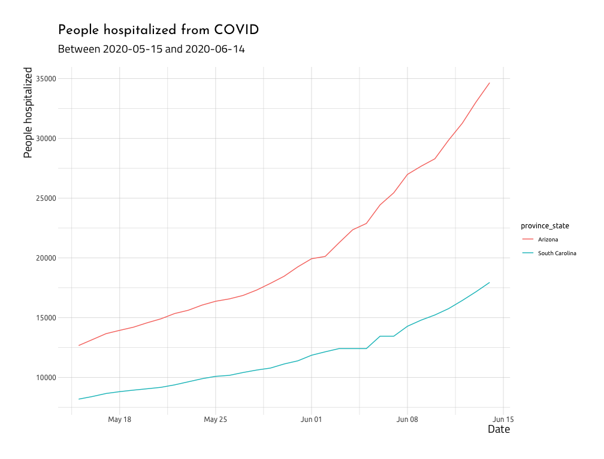
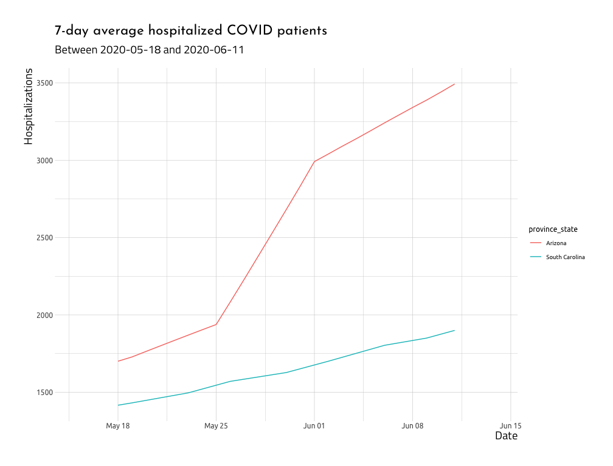
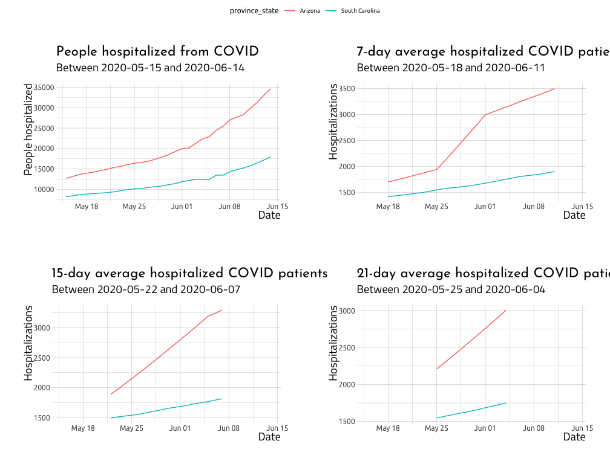
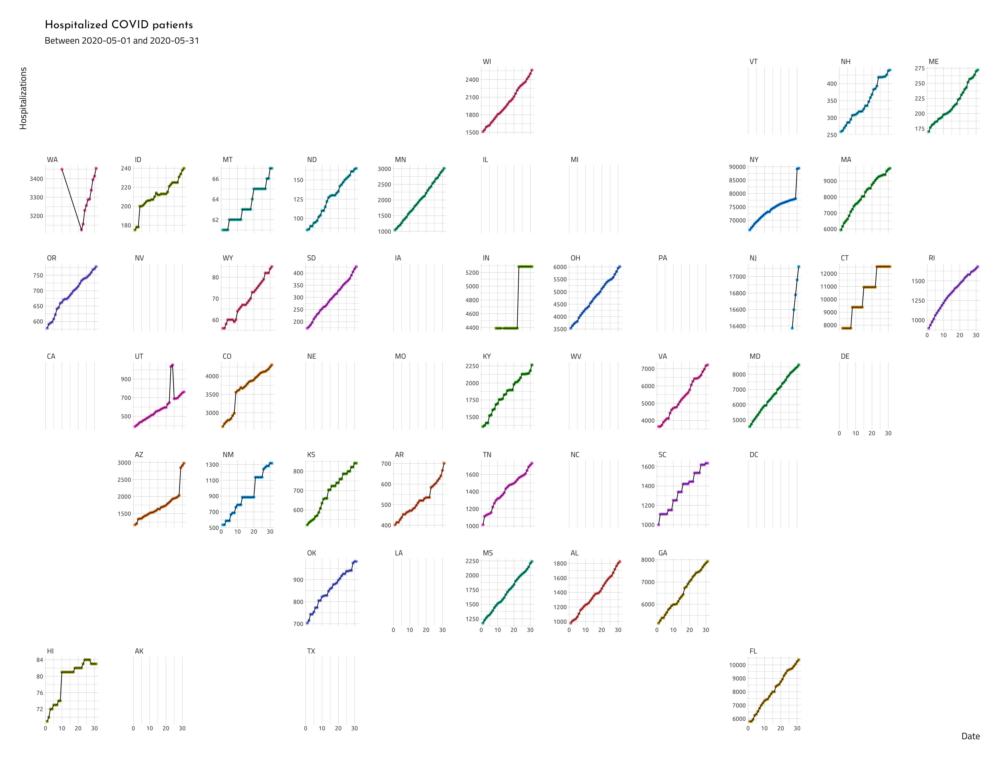
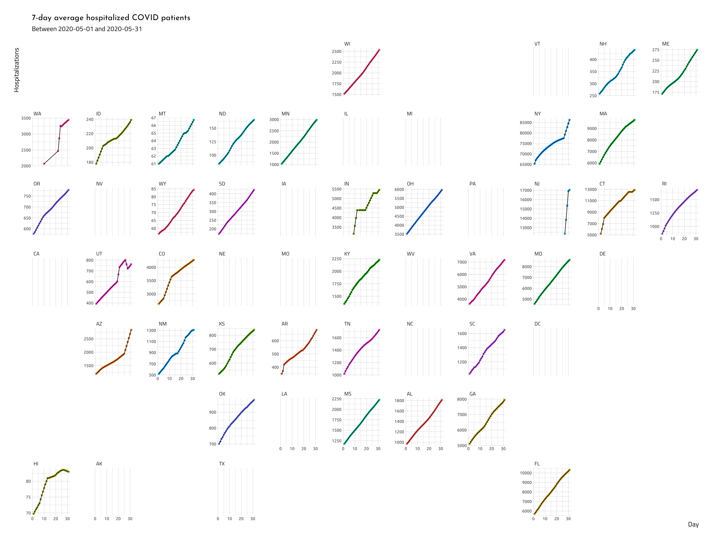

How to calculate a moving average
================
Martin Frigaard

## Moving averages

Moving averages are a way to reduce noise and smooth time series data.
This post will cover how to compute and visualize a seven-day average
for the hospitalized COVID patients in United States.

## Packages

We’ll load the packages below and set our graph theme.

``` r
library(ggpubr) # grid arrage
library(fpp2)           
library(zoo) # moving averages        
library(quantmod)
library(tidyverse) # all tidyverse packages
library(plotly) # more plots
library(skimr) # summaries 
library(hrbrthemes) # themes for graphs
library(socviz)
library(openintro)
library(geofacet)
# graph theme
ggplot2::theme_set(hrbrthemes::theme_ipsum_tw(
  base_size = 9,
  strip_text_size = 11,
  axis_title_size = 14,
  plot_title_size = 17,
  subtitle_size = 14,
  base_family = "Ubuntu",
  strip_text_family = "TitilliumWeb-Regular",
  axis_title_family = "TitilliumWeb-Regular",
  subtitle_family = "TitilliumWeb-Regular",
  plot_title_family = "JosefinSans-Regular"
))
library(ggmap) # mapping
library(forecast)
```

## Import COVID data

The code block below imports the COVID-19 data from [Center for Systems
Science and Engineering at the Johns Hopkins Whiting School of
Engineering](https://github.com/CSSEGISandData/COVID-19) using the
[`fs`](https://www.tidyverse.org/blog/2018/01/fs-1.0.0/) and
[`purrr`](https://purrr.tidyverse.org/) packages. We are going to limit
these data to four states that have [relaxed their shelter in place
restrictions](https://www.cnn.com/interactive/2020/us/states-reopen-coronavirus-trnd/):
Arizona and South Carolina.

We’ll also tidy up these data a bit with
[`janitor::clean_names()`](https://sfirke.github.io/janitor/) and remove
any non-USA data with missing latitude and longitude.

``` r
## ----import-csse_csv_files------------------------------------------
csse_csv_files <- fs::dir_ls(path = "data/jhsph/COVID-19/csse_covid_19_data/csse_covid_19_daily_reports_us", 
           glob = "*.csv")
# head(csse_csv_files)
DailyCovid19Raw <- csse_csv_files %>%
  purrr::map_df(.f = read_csv, .id = "file", col_types = cols()) %>% 
    janitor::clean_names(case = "snake")
DailyCovid19 <- DailyCovid19Raw %>% 
    # non-missing geospatial data
    dplyr::filter(!is.na(lat) & !is.na(long)) %>% 
    # state-level data
    dplyr::filter(province_state %in% 
                    c("Arizona", "South Carolina")) %>% 
    # reorganize
    dplyr::select(file, 
                  lat, 
                  long,
                  last_update,
                  province_state,
                  country_region,
                  iso3,
                  confirmed,
                  people_hospitalized,
                  deaths,
                  dplyr::ends_with("_rate")) 
```

We’ll get a quick overview of the data with
[`skimr`](https://docs.ropensci.org/skimr/).

``` r
# drop p25 and p75
my_skim <- skimr::skim_with(numeric = skimr::sfl(p25 = NULL, p75 = NULL))
DailyCovid19 %>% my_skim()
```

|                                                  |            |
| :----------------------------------------------- | :--------- |
| Name                                             | Piped data |
| Number of rows                                   | 126        |
| Number of columns                                | 14         |
| \_\_\_\_\_\_\_\_\_\_\_\_\_\_\_\_\_\_\_\_\_\_\_   |            |
| Column type frequency:                           |            |
| character                                        | 4          |
| numeric                                          | 9          |
| POSIXct                                          | 1          |
| \_\_\_\_\_\_\_\_\_\_\_\_\_\_\_\_\_\_\_\_\_\_\_\_ |            |
| Group variables                                  | None       |

Data summary

**Variable type: character**

| skim\_variable  | n\_missing | complete\_rate | min | max | empty | n\_unique | whitespace |
| :-------------- | ---------: | -------------: | --: | --: | ----: | --------: | ---------: |
| file            |          0 |              1 |  84 |  84 |     0 |        63 |          0 |
| province\_state |          0 |              1 |   7 |  14 |     0 |         2 |          0 |
| country\_region |          0 |              1 |   2 |   2 |     0 |         1 |          0 |
| iso3            |          0 |              1 |   3 |   3 |     0 |         1 |          0 |

**Variable type: numeric**

| skim\_variable        | n\_missing | complete\_rate |     mean |      sd |       p0 |     p50 |     p100 | hist  |
| :-------------------- | ---------: | -------------: | -------: | ------: | -------: | ------: | -------: | :---- |
| lat                   |          0 |           1.00 |    33.79 |    0.06 |    33.73 |   33.79 |    33.86 | ▇▁▁▁▇ |
| long                  |          0 |           1.00 |  \-96.19 |   15.30 | \-111.43 | \-96.19 |  \-80.94 | ▇▁▁▁▇ |
| confirmed             |          0 |           1.00 | 11226.72 | 6859.12 |  3320.00 | 9343.00 | 34660.00 | ▇▅▂▁▁ |
| people\_hospitalized  |          1 |           0.99 |  1562.75 |  789.23 |   496.00 | 1444.00 |  3692.00 | ▇▇▃▁▂ |
| deaths                |          0 |           1.00 |   469.37 |  286.45 |    82.00 |  411.50 |  1189.00 | ▇▇▃▃▂ |
| incident\_rate        |          0 |           1.00 |   179.48 |   94.86 |    48.66 |  160.28 |   476.18 | ▇▇▃▂▁ |
| mortality\_rate       |          0 |           1.00 |     4.07 |    0.63 |     2.42 |    4.20 |     5.01 | ▂▂▃▇▅ |
| testing\_rate         |          0 |           1.00 |  2180.91 | 1314.67 |   578.52 | 1870.19 |  4904.76 | ▇▅▃▃▂ |
| hospitalization\_rate |          1 |           0.99 |    14.62 |    2.02 |    10.65 |   14.99 |    19.00 | ▆▅▇▇▂ |

**Variable type: POSIXct**

| skim\_variable | n\_missing | complete\_rate | min                 | max                 | median              | n\_unique |
| :------------- | ---------: | -------------: | :------------------ | :------------------ | :------------------ | --------: |
| last\_update   |          0 |              1 | 2020-04-12 23:18:15 | 2020-06-14 03:33:28 | 2020-05-14 03:32:32 |        63 |

We want a tidy dataset with column for `people_hospitalized` cases,
indexed by the `province_state`. I’ll convert the `last_update` column
to a `date` variable with some help from
[`lubridate`.](https://lubridate.tidyverse.org/), and limit these data
for one month (`2020-05-15` - `2020-06-14`) for the same of simplicity.

``` r
MayJuneDCovid19 <- DailyCovid19 %>% 
  dplyr::mutate(date = lubridate::as_date(last_update)) %>% 
  dplyr::filter(date >= as.Date("2020-05-15") & 
                  date <= as.Date("2020-06-14")) 
my_skim(MayJuneDCovid19$date)
```

|                                                  |                      |
| :----------------------------------------------- | :------------------- |
| Name                                             | MayJuneDCovid19$date |
| Number of rows                                   | 62                   |
| Number of columns                                | 1                    |
| \_\_\_\_\_\_\_\_\_\_\_\_\_\_\_\_\_\_\_\_\_\_\_   |                      |
| Column type frequency:                           |                      |
| Date                                             | 1                    |
| \_\_\_\_\_\_\_\_\_\_\_\_\_\_\_\_\_\_\_\_\_\_\_\_ |                      |
| Group variables                                  | None                 |

Data summary

**Variable type: Date**

| skim\_variable | n\_missing | complete\_rate | min        | max        | median     | n\_unique |
| :------------- | ---------: | -------------: | :--------- | :--------- | :--------- | --------: |
| data           |          0 |              1 | 2020-05-15 | 2020-06-14 | 2020-05-30 |        31 |

## Calculate rolling averages

To calculate a simple moving average (over 7 days), we can use the
`rollmean()` function from the [zoo
package.](https://cran.r-project.org/web/packages/zoo/index.html). This
function takes a `k`, which is an ’*integer width of the rolling
window.*

The code below calculates a 7, 15, and 21-day rolling average for the
`people_hospitalized` from COVID in the US. It’s good practice to
calculate rolling averages in an odd order (it makes the resulting
values symmetrical).

``` r
MayJuneDCovid19 <- MayJuneDCovid19 %>%
    dplyr::group_by(province_state) %>% 
    dplyr::mutate(hosp_7da = zoo::rollmean(people_hospitalized, k = 7, fill = NA),
                  hosp_15da = zoo::rollmean(people_hospitalized, k = 15, fill = NA),
                  hosp_21da = zoo::rollmean(people_hospitalized, k = 21, fill = NA)) %>% 
  dplyr::ungroup()
```

We will start by visualizing the `people_hospitalized` across the four
states by piping it over to line graph from
[`ggplot2`](https://ggplot2.tidyverse.org/reference/geom_path.html).

``` r
# date labels 
date_hosp_raw <- filter(MayJuneDCovid19, !is.na(people_hospitalized)) 
# plot
gg_hospitalized <- MayJuneDCovid19 %>%
    ggplot2::ggplot(aes(x = date, 
                        y = confirmed, 
                        color = province_state)) +
    ggplot2::geom_line() + 
    ggplot2::labs(title = "People hospitalized from COVID", 
                  subtitle = paste0("Between " ,
                                    min(date_hosp_raw$date), 
                                    " and ", 
                                    max(date_hosp_raw$date)),
                  y = "People hospitalized", 
                  x = "Date")
gg_hospitalized
```

<!-- -->

Now we will compare this to the seven-day average of hospitalized COVID
patients.

``` r
# date labels
date_7da <- dplyr::filter(MayJuneDCovid19, !is.na(hosp_7da))
# plot
gg_hosp_7da <- MayJuneDCovid19 %>%
    ggplot2::ggplot(aes(x = date, 
                        y = hosp_7da, 
                        color = province_state)) +
    ggplot2::geom_line() + 
    ggplot2::labs(title = "7-day average hospitalized COVID patients", 
                  subtitle = paste0("Between ", 
                                    min(date_7da$date), " and ", 
                                    max(date_7da$date)),
                  y = "Hospitalizations", 
                  x = "Date")
gg_hosp_7da
```

<!-- -->

As we can see, the seven-day average lines are much smoother than the
raw `confirmed` values. This is because the `zoo::rollmean()` function
works by successively averaging each period together. See the graphs
below.

``` r
# date labels
date_15da <- filter(MayJuneDCovid19, !is.na(hosp_15da)) 
# plot 15 days
gg_hosp_15da <- MayJuneDCovid19 %>%
    ggplot2::ggplot(aes(x = date, 
                        y = hosp_15da, 
                        color = province_state)) +
    ggplot2::geom_line() + 
    ggplot2::labs(title = "15-day average hospitalized COVID patients", 
                  subtitle = paste0("Between ", 
                                    min(date_15da$date), " and ", 
                                    max(date_15da$date)),
                  y = "Hospitalizations", 
                  x = "Date")
# date labels
date_21da <- filter(MayJuneDCovid19, !is.na(hosp_21da))
# plot 21 days
gg_hosp_21da <- MayJuneDCovid19 %>%
    ggplot2::ggplot(aes(x = date, 
                        y = hosp_21da, 
                        color = province_state)) +
    ggplot2::geom_line() + 
    ggplot2::labs(title = "21-day average hospitalized COVID patients", 
                  subtitle = paste0("Between ", 
                                    min(date_21da$date), " and ", 
                                    max(date_21da$date)),
                  y = "Hospitalizations", 
                  x = "Date")
# arrange plots
ggpubr::ggarrange(gg_hospitalized,
                  gg_hosp_7da, 
                  gg_hosp_15da, 
                  gg_hosp_21da, 
                  common.legend = TRUE,
                  nrow = 2, 
                  ncol = 2)
```

<!-- -->

Knowing which period (`k`) to use is a judgment call. The higher the
value of `k`, the smoother the line gets, but are also sacrificing more
data. If we compare the 7-day average to the 15 and 21-day averages, we
see the date ranges are increasingly limited.

### Where are the data going?

If we look at the table display below of Arizona, we can see the first
three dates of `hosp_7da` are missing.

| State   | Date       | Hospitalizations | 7-day average hospitalizations |
| :------ | :--------- | ---------------: | -----------------------------: |
| Arizona | 2020-05-15 |             1636 |                             NA |
| Arizona | 2020-05-16 |             1629 |                             NA |
| Arizona | 2020-05-17 |             1683 |                             NA |
| Arizona | 2020-05-18 |             1699 |                       1700.286 |
| Arizona | 2020-05-19 |             1717 |                       1728.000 |
| Arizona | 2020-05-20 |             1746 |                       1763.714 |

The table below shows the last three observations are missing, too. This
is because we don’t have `people_hospitalized` values to calculate a
rolling mean for this value.

| State   | Date       | Hospitalizations | 7-day average hospitalizations |
| :------ | :--------- | ---------------: | -----------------------------: |
| Arizona | 2020-06-09 |             3377 |                       3389.571 |
| Arizona | 2020-06-10 |             3406 |                       3440.571 |
| Arizona | 2020-06-11 |             3476 |                       3493.714 |
| Arizona | 2020-06-12 |             3531 |                             NA |
| Arizona | 2020-06-13 |             3622 |                             NA |
| Arizona | 2020-06-14 |             3692 |                             NA |

## Moving averages with geofacets

We’ll take a look at the seven-day moving averages of people
hospitalized across all states using the
[`geofacet`](https://hafen.github.io/geofacet/) package.

First we’ll get the state abbreviations by creating a crosswalk table
and joining these with the `DailyCovid19Raw` dataset.

``` r
state.name <- state.name
state.abb <- state.abb
StateCrosswalk <- tibble::tibble(state = state.name) %>%
  # stick this to the abbreviations
   dplyr::bind_cols(tibble::tibble(state_abbr = state.abb)) %>% 
  # bind this to District of Columbia
   dplyr::bind_rows(tibble(state = "District of Columbia", state_abbr = "DC"))
# rename state
DailyCovid19 <- DailyCovid19Raw %>% 
                dplyr::rename(state = province_state) %>% 
                # join these two together
                dplyr::left_join(x = ., 
                                 y = StateCrosswalk,
                                 by = "state")
# remove non-states
DailyCovid19 <- DailyCovid19 %>% 
    dplyr::filter(state %nin% c("American Samoa", "Diamond Princess", 
                                         "Grand Princess", "Guam", 
                                         "Northern Mariana Islands", 
                                         "Puerto Rico", "Virgin Islands"))
```

Now we’ll create new `date` and `day` variables, remove missing
`people_hospitalized` values, calculate the moving seven-day average per
state, then limit these data to the month of May.

``` r
DailyCovid19 <- DailyCovid19 %>% 
  dplyr::mutate(date = lubridate::as_date(last_update),
                # day
                day = lubridate::day(last_update)) %>% 
  # remove missing people_hospitalized
  dplyr::filter(!is.na(people_hospitalized)) %>% 
  # group by state
  dplyr::group_by(state_abbr) %>% 
  # calculate moving averages
  dplyr::mutate(hosp_7da = zoo::rollmean(people_hospitalized, 
                                         k = 7,
                                         fill = NA)) %>% 
  # ungroup
  dplyr::ungroup() %>% 
  # filter to month from above
  dplyr::filter(date >= as.Date("2020-05-01") & 
                  date <= as.Date("2020-05-31")) 
```

Now we can plot these data using the `geofacet::facet_geo()` function.
We will start with the raw values for `people_hospitalized`.

``` r
# labels
date_hops_raw <- filter(DailyCovid19, !is.na(people_hospitalized))
# plots
DailyCovid19 %>% 
    ggplot2::ggplot(aes(x = day, 
                        y = people_hospitalized,
                        group = state_abbr)) +
    ggplot2::geom_point(aes(color = state_abbr), show.legend = FALSE) + 
    ggplot2::geom_line(aes(group = state_abbr), show.legend = FALSE) +
    geofacet::facet_geo(~ state_abbr, 
                        grid = "us_state_grid1",
                        scales = "free_y")  +
      ggplot2::labs(title = "Hospitalized COVID patients", 
                  subtitle = paste0("Between ", 
                                    min(date_hops_raw$date), " and ", 
                                    max(date_hops_raw$date)),
                  y = "Hospitalizations", 
                  x = "Date") 
```



It’s clear not all states have complete data for COVID-19
hospitalizations, but the states with data appear somewhat noisy.

We will plot the seven-day rolling average below.

``` r
# labels
date_7da <- filter(DailyCovid19, !is.na(hosp_7da))
# plot
DailyCovid19 %>% 
    ggplot2::ggplot(aes(x = day, 
                        y = hosp_7da,
                        group = state_abbr)) +
    ggplot2::geom_point(aes(color = state_abbr), show.legend = FALSE) + 
    ggplot2::geom_line(aes(group = state_abbr), show.legend = FALSE) +
    geofacet::facet_geo(~ state_abbr, 
                        grid = "us_state_grid1",
                        scales = "free_y") +
      ggplot2::labs(title = "7-day average hospitalized COVID patients", 
                  subtitle = paste0("Between ", 
                                    min(date_7da$date), " and ", 
                                    max(date_7da$date)),
                  y = "Hospitalizations", 
                  x = "Day")
```



We can see the moving averages are much smoother than the raw
hospitalization values, specifically for states like South Carolina, New
Mexico, and Montana.

### More notes on rolling/moving averages:

  - “*A moving average term in a time series model is a past error
    (multiplied by a coefficient). Moving average is also used to smooth
    the series. It does this be removing noise from the time series by
    successively averaging terms together*” - Machine Learning Using R:
    With Time Series and Industry-Based Use Cases in R

  - [“*Moving averages is a smoothing approach that averages values from
    a window of consecutive time periods, thereby generating a series of
    averages. The moving average approaches primarily differ based on
    the number of values averaged, how the average is computed, and how
    many times averaging is
    performed*”](https://uc-r.github.io/ts_moving_averages).

  - [*"To compute the moving average of size k at a point p, the k
    values symmetric about p are averaged together which then replace
    the current value. The more points are considered for computing the
    moving average, the smoother the curve
    becomes.*"](http://www.feat.engineering/reducing-other-noise.html)
