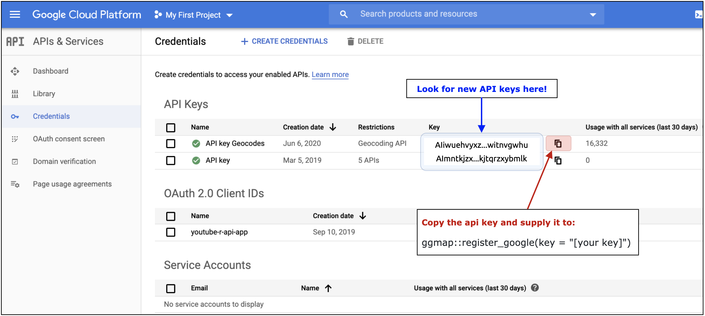
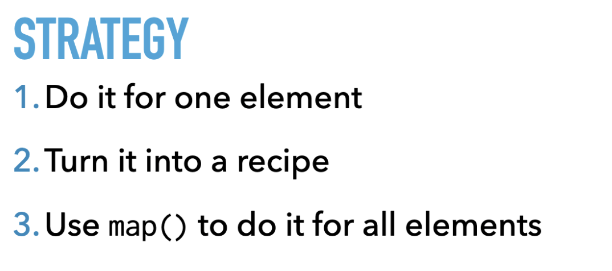
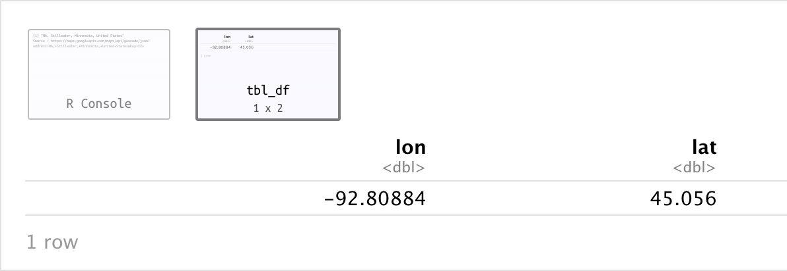
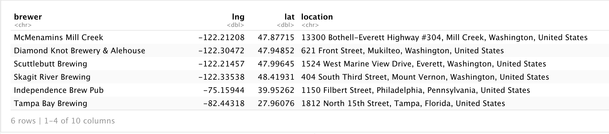
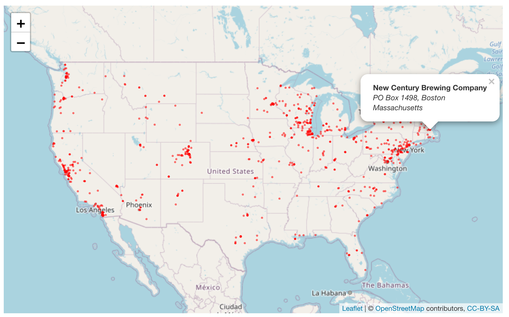

Update: How to geocode a csv of addresses in R
================
Martin Frigaard

This post is an update from the previous post, [“How to geocode a CSV of
addresses in R”](https://www.storybench.org/geocode-csv-addresses-r/).
We will be using the [`ggmap`](https://github.com/dkahle/ggmap) package
again, and be sure to investigate the usage and billing policy for
[Google’s Geocoding
API](https://developers.google.com/maps/documentation/geocoding/usage-and-billing).
The API now has a [pay-as-you-go
model](https://developers.google.com/maps/documentation/geocoding/usage-and-billing#how-usage-and-billing-work-under-the-pay-as-you-go-model),
and every account gets a certain number of requests free per month,

> For each billing account, for qualifying Google Maps Platform SKUs, a
> $200 USD Google Maps Platform credit is available each month, and
> automatically applied to the qualifying SKUs.

Check out our posts on getting started with [R &
RStudio](https://www.storybench.org/getting-started-r-rstudio-notebooks/)
and the other how-tos in the [Data Journalism with R
project](https://www.storybench.org/category/data-journalism-in-r/).

## The ggmap package in R Studio

The code below will install and load the `ggmap` and
[`tidyverse`](https://www.tidyverse.org/) packages. We’ve covered the
`tidyverse` in previous posts, but all you need to know right now is
that we’ll be using the [`purrr` package](https://purrr.tidyverse.org/)
for iteration.

``` r
install.packages(c("tidyverse", "ggmap"))
library(tidyverse)
library(ggmap)
```

## Import the data

In the previous post, we used a dataset of breweries in Boston, MA. In
this post, we’ll be using a subset of the data from the [Open Beer
Database](https://data.opendatasoft.com/explore/dataset/open-beer-database%40public-us/information/),
which we’ve downloaded as a CSV.

The code below imports these data into RStudio as `BeerDataUS`. We’ll
use the `dplyr::glimpse()` function to take a look at these data.

``` r
BeerDataUS <- readr::read_csv(file = "data/BeerDataUS.csv")
dplyr::glimpse(BeerDataUS)
```

    #>  Rows: 823
    #>  Columns: 6
    #>  $ brewer  <chr> "McMenamins Mill Creek", "Diamond Knot Brewery & Alehouse",…
    #>  $ address <chr> "13300 Bothell-Everett Highway #304", "621 Front Street", "…
    #>  $ city    <chr> "Mill Creek", "Mukilteo", "Everett", "Mount Vernon", "Phila…
    #>  $ state   <chr> "Washington", "Washington", "Washington", "Washington", "Pe…
    #>  $ country <chr> "United States", "United States", "United States", "United …
    #>  $ website <chr> NA, "http://www.diamondknot.com/", NA, NA, "http://www.inde…

We have a dataset with all the components of a physical address, but no
latitude and longitude values.

## Setting up your GeoCoding API key

Before we can use Google’s geocode API, we need to set up an API key.
Follow the instructions [here](https://github.com/dkahle/ggmap/) and
[here](https://cran.r-project.org/web/packages/ggmap/ggmap.pdf), and you
should get to this Google dashboard:



Your **private** API key needs to be registered with
`ggmap::register_google(key = "[your key]")`. More detailed instructions
have been pasted below from the [package Github
page](https://github.com/dkahle/ggmap/):

> Inside R, after loading the new version of `ggmap`, you’ll need
> provide `ggmap` with your API key, a hash value (think string of
> jibberish) that authenticates you to Google’s servers. This can be
> done on a temporary basis with `register_google(key = "[your key]")`
> or permanently using `register_google(key = "[your key]", write =
> TRUE)` (note: this will overwrite your `~/.Renviron` file by
> replacing/adding the relevant line). If you use the former, know that
> you’ll need to re-do it every time you reset R.

After registering your API key, you’ll have access to the two functions
for getting geocodes in `ggmap`: `geocode()` and `revgeocode()`.

### Create a location column

We need the address items into a new `location` column:

``` r
BeerDataUS <- BeerDataUS %>% 
  tidyr::unite(data = ., 
               # combine all the location elements 
               address, city, state, country, 
               # new name for variable
               col = "location", 
               # separated by comma
               sep = ", ",
               # keep the old columns
               remove = FALSE)
# check the new variable
BeerDataUS %>% 
  dplyr::pull(location) %>% 
  utils::head()
```

    #>  [1] "13300 Bothell-Everett Highway #304, Mill Creek, Washington, United States"
    #>  [2] "621 Front Street, Mukilteo, Washington, United States"                    
    #>  [3] "1524 West Marine View Drive, Everett, Washington, United States"          
    #>  [4] "404 South Third Street, Mount Vernon, Washington, United States"          
    #>  [5] "1150 Filbert Street, Philadelphia, Pennsylvania, United States"           
    #>  [6] "1812 North 15th Street, Tampa, Florida, United States"

We’ll follow the iteration strategy from [Charlotte Wickham’s tutorial
on
purrr](https://rstudio.com/resources/rstudioconf-2017/happy-r-users-purrr-tutorial-/).



## Get a geocode for a single element

This will produce the following output:

``` r
single_element <- base::sample(x = BeerDataUS$location, 
                               size = 1, 
                               replace = TRUE)
single_element
ggmap::geocode(location = single_element)
```

    > ggmap::geocode(location = single_element)
    Source : https://maps.googleapis.com/maps/api/geocode/json?address=NA,+Stillwater,+Minnesota,+United+States&key=xxx



## Turn it into a recipe

Now we turn this into a `purrr::recipe`. We’ll use the `purrr::map_df()`
variant to get the result in a `tibble/data.frame`.

``` r
GeoCoded <- purrr::map_df(.x = BeerDataUS$location, .f = ggmap::geocode)
```

This will take some time, and you should see the following in the
console:

<!-- -->

When it’s done, you’ll have the following new dataset:

``` r
utils::head(x = GeoCoded)
```

``` r
# A tibble: 6 x 2
     lon   lat
   <dbl> <dbl>
1 -122.   47.9
2 -122.   47.9
3 -122.   48.0
4 -122.   48.4
5  -75.2  40.0
6  -82.4  28.0
```

Now we just need to column bind these to the `BeerDataUS` dataset and
create a new `popuptext` column. We’ll also rename the `lon` column as
`lng` because it’s more common in the graphics we’ll be building.

``` r
GeoCodedBeerData <- dplyr::bind_cols(BeerDataUS, GeoCoded) %>% 
  dplyr::select(
    brewer,
    lng = lon,
    lat,
    dplyr::everything())
# create a popuptext column
GeoCodedBeerData <- GeoCodedBeerData %>%  
  dplyr::mutate(popuptext = base::paste0("<b>", 
                                 GeoCodedBeerData$brewer, 
                                 "</b><br />",
                                 "<i>",
                                 GeoCodedBeerData$address, 
                                 ", ", 
                                 GeoCodedBeerData$city,
                                 "</i><br />",
                                 "<i>",
                                 GeoCodedBeerData$state, 
                                 "</i>"))
```

``` r
utils::head(GeoCodedBeerData)
```



Now that we have a dataset with latitude and longitude columns, we can
start mapping the data\!

## Create a map

We will use the [`leaflet` package](https://rstudio.github.io/leaflet/)
to generate a quick map of brewery locations in the US.

``` r
# get a random lat and lng for the setView()
# GeoCodedBeerData %>% 
#   dplyr::sample_n(size = 1) %>% 
#   dplyr::select(lat, lng)
leaflet::leaflet(data = GeoCodedBeerData) %>% 
  leaflet::addTiles() %>% 
  leaflet::setView(lng = -96.50923, # random location
                   lat = 39.19729, 
                   zoom = 4) %>% # zoom in on US
  leaflet::addCircles(color = "red",
                      lng = ~lng, 
                      lat = ~lat, 
                      weight = 1.5,
                      popup = ~popuptext)
```


